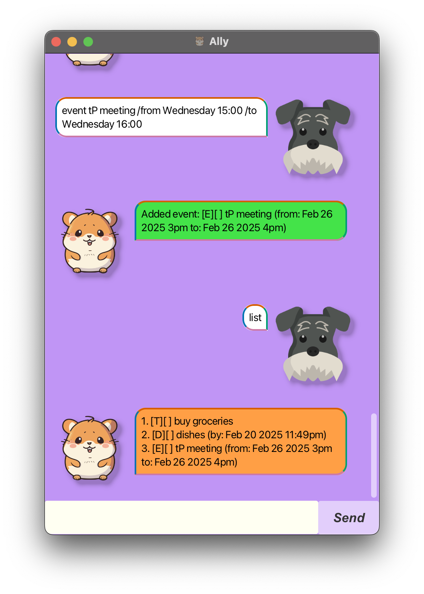

# Ally User Guide

Meet **Ally**, the future of task management. Ally offers a beginner-friendly system with a text-based interface and BLAZINGLY FAST performance

---

# Features

## Viewing help: `help`
Displays a list of all available commands along with how to use them.

Format: `help`

 

## Adding a todo: `todo`
Adds a todo to the task list.

Format: `todo NAME_OF_TODO`

Examples:
- `todo Study`
- `todo Wash dishes`

 

## Adding a deadline: `deadline`
Adds a deadline to the task list.

Format: `deadline NAME_OF_DEADLINE /by DEADLINE`

Examples:
- `deadline Submit CS2109S PS2 /by 15/02/2025 23:59`
- `deadline Submit CS2106 Lab 1 /by Sunday 23:59` (note: the day specified here will be the nearest day ahead of the current day)

 

## Adding an event: `event`
Adds an event to the task list.

Format: `event NAME_OF_EVENT /from START_TIME /to END_TIME`

Examples:
- `event Ally's Birthday /from 28/04/2025 17:00 /to 28/04/2025 22:00`
- `event Team Meeting /from Wednesday 15:00 /to Wednesday 16:00` (note: the day specified here will be the nearest day ahead of the current day)

 

## Listing all tasks: `list`
Lists all tasks on the task list.

Format: `list`

 

## Finding tasks by keyword or date: `find`
Filters the task list by keyword or date.

Format: `find KEYWORD` or `find DATE`
- The search is case-insensitive. e.g. `study` will match `Study`

Examples:
- `find Study` returns `study CS2103T` and `Study with Ally`
- `find 2025-02-27` returns all tasks happening on 27th February 2025

 

## Marking a task: `mark`
Marks an existing task on the task list.

Format: `mark INDEX`

- Marks the task at the specified INDEX. 
- The index refers to the index number shown in the displayed task list. 
- The index must be a positive integer 1, 2, 3, ...

Examples:
- `mark 2` marks the 2nd task in the task list.

 

## Unmarking a task: `unmark`
Unmarks an existing task on the task list.

Format: `unmark INDEX`

- Unmarks the task at the specified INDEX. 
- The index refers to the index number shown in the displayed task list. 
- The index must be a positive integer 1, 2, 3, ...

Examples:
- `unmark 2` unmarks the 2nd task in the task list.

 

## Deleting a task: `delete`
Deletes an existing task from the task list.

Format: `delete INDEX`

- Deletes the task at the specified INDEX. 
- The index refers to the index number shown in the displayed task list. 
- The index must be a positive integer 1, 2, 3, ...

Examples:
- `delete 2` deletes the 2nd task in the task list.

 

## Exiting the program: `bye`
Exits the program.

Format: `bye`